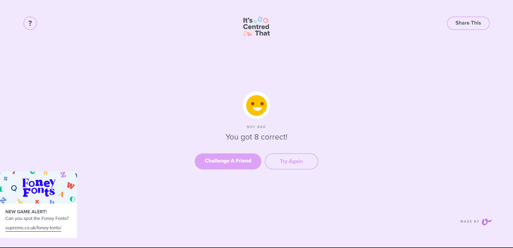

## Hello there, my fellow Alfbuddy! 💖

You've made it—great job! Now, here's the scoop: this markdown file is your **canvas**. Customize it; let your creativity flow!

Remember, you're free to add your personal touch, but keep the sacred requirements intact; they are the guardians of order here. This markdown file should or may include:

#### 1. UI and UX analyses for Day 1

_(just choose the questions you would like to answer and make it concise)_
  
&nbsp;&nbsp;&nbsp;&nbsp;**User-Experience Analysis:** 

-   Which website is easier to find the product you are looking for? 
    Answer: In my opinion, Shopee's simplistic layout makes it easier to find the products you are looking for. 

-   Identify any distractions or unnecessary elements that could potentially confuse users. 
    Answer: 
    -   When looking at an individual items' picture, both of them provide graphics such as the 'preferred' icon for shopee and 'LazMall' title for Lazada that moreso makes it cluttered rather than provide information on the product. It's obvious that these graphics only really serve as a way to entice customers to buy products.
    -   When you open shopee's homepage, a side pop up banner will sometimes appear that may end up causing distraction.

-   Compare the organization of content between the two platforms. Which between the two platforms’ content is easier to scan and understand? 
    Answer: As previously mentioned, Shopee with it's more simplistic way of showcasing the products makes it easier for users to scan and identify products that they might want to buy. Additionally, one other thing I noticed as I'm scrolling through Lazada is how the larger font size that they use often causes the product's title to cut off even before you can read what the product's name is. Compared to how shopee showcases two lines in the product's title, I think there's a probability that someone who uses Lazada may just end up sliding through a product without fully knowing what it's for just from the pictures alone.

  &nbsp;&nbsp;&nbsp;&nbsp;**User-Interface Analysis:**

-   Is the websites’ layout and design visually pleasing and consistent with their brand? 
    Answer: I think both of them does an okay job with maintaining a visually consistent design, though when comparing the two, I think Shopee definitely has a more polished and organized look especially with how they use their colors to guide users. (Though in my personal opinion, since I'm not really much of a fan for overly bright colors lol, I prefer Lazada's Color Scheme)
    
-   Comment on the responsiveness of both websites across different devices. 
    Answer: Based on my experience when browsing both sites, Lazada sometimes takes longer to load than Shopee. Even in simple things such as the product ratings and buyer gallery, I found it much faster to browse through Shopee.
    
-   Which do you think is better when it comes to the visual aspect of the website? 
    Answer: I think Shopee's more cohesive with their color scheme, and the font sizes that they use (wherein some information has smaller fonts, and important ones such as a product's title is larger) makes it more visually appealing and easier to skim through products.
    
     

#### 2. An **optional** screenshot of playing the game **"It's Centred That"** and your feedback

-   I played it for about 10+ minutes, for some of the items where the dot wasn't in the center, it made me realize how much of a difference an object being slightly off-center was. I was shocked at when some of the dots were supposedly just a little bit off-center, but when I looked at it without the guidelines, it looked much more off-target.

 Ready to include your output for **Day 1**? Let the customization begin! 🚀✨

<!-- You may now delete and modify the content of this file -->
