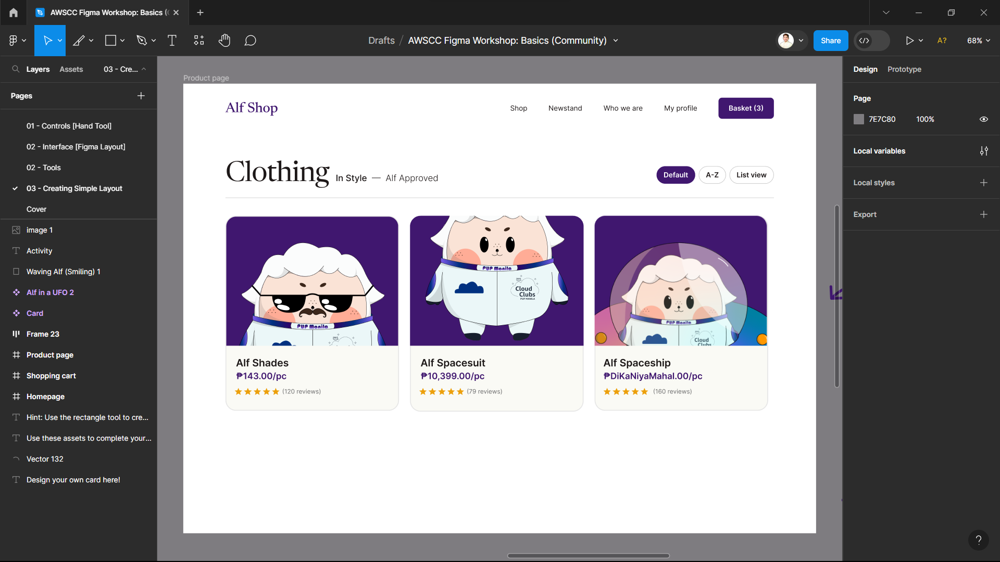

## Hello there, my fellow Alfbuddy! 💖

You've made it—great job! Now, here's the scoop: this markdown file is your **canvas**. Customize it; let your creativity flow!

Remember, you're free to add your personal touch, but keep the sacred requirements intact; they are the guardians of order here. This markdown file should include:
- Link to your own file of **"Figma Basics Tutorial"**
    > <a href="https://www.figma.com/file/aB9jPkqOUyivXfskZGhgpK/AWSCC-Figma-Workshop%3A-Basics-(Community)?type=design&node-id=0%3A1&mode=design&t=iRS7YfhfE0SmIBoE-1">My Own Work </a>
    - 
- Brief explanation of your experience or reflection
    -   Just like with any other editing software that I've used before, there definitely was a learning curve for me in terms of getting used to the interface. The amount of work that I did vs. the amount of time it took me to get it done definitely has a huge gap as of right now, lol. But overall, when it comes to the experience of using Figma itself, while it would probably take me a bit more longer in order to use it smoothly, I found it quite easy to understand as of right now. The interface itself is quite simplistic, so I'd say that definitely helps me so that I won't be confused and get lost while editing.

Ready to include your output for **Day 2**? Let the customization begin! 🚀✨

<!-- You may now delete and modify the content of this file -->