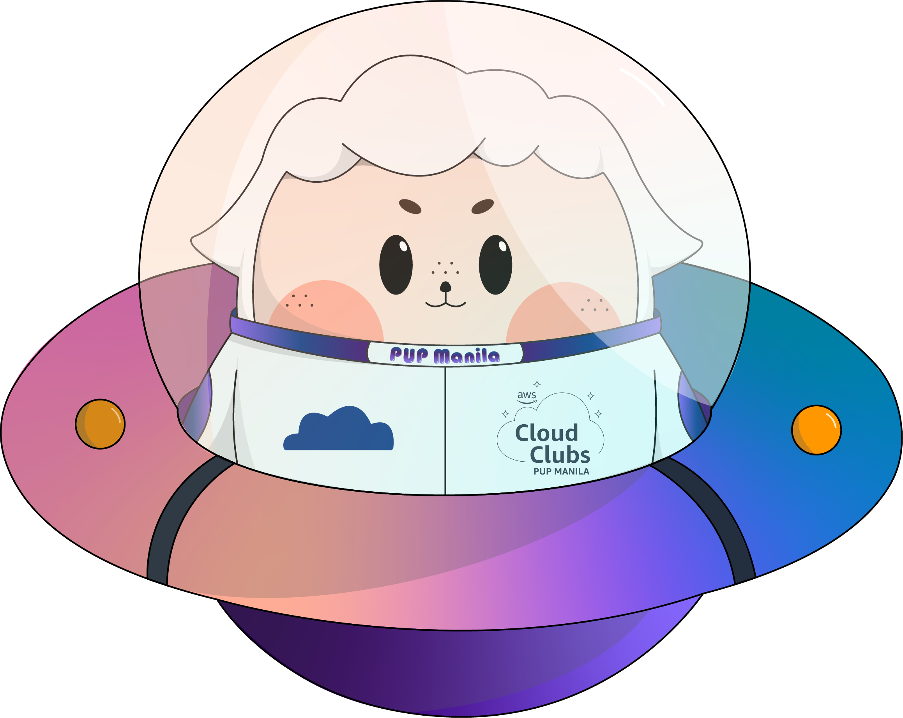

## Hello there, my fellow Alfbuddy! 💖

You've made it—great job! Now, here's the scoop: this markdown file is your **canvas**. Customize it; let your creativity flow!

Remember, you're free to add your personal touch, but keep the sacred requirements intact; they are the guardians of order here. This markdown file should or may include:
- Link to your own file of **"Week 1 [Day 3] : Activity"**
    > <a href="https://www.figma.com/file/OCfo549zwBaX6K9RrkvZlU/Week-1-%5BDay-3%5D-%3A-Activity-(Community)?type=design&node-id=202%3A37&mode=design&t=wNUTvwtPYnDxvSNZ-1">My Own Work </a>
    -   
- An **optional** screenshot of playing the game **"Can't Unsee"** and your feedback
    - 
    -   I had quite a difficult time since some of the items had such minute differences that it almost took me two-to-three minutes just to guess. Apart from my own personal experience though, I guess something that I learned from this game is that designing something, specifically trying to adhere to the aforementioned C.R.A.P design principles, is much harder than what one may think. There's so many different factors to consider, and failure in doing so for multiple of these principle may end up causing your design to be less visually appealing. ;-;

Ready to include your output for **Day 3**? Let the customization begin! 🚀✨

<!-- You may now delete and modify the content of this file -->