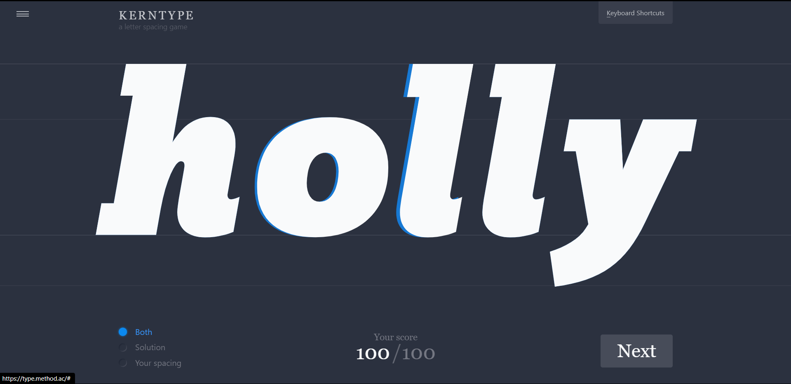

## Hello there, my fellow Alfbuddy! 💖

You've made it—great job! Now, here's the scoop: this markdown file is your **canvas**. Customize it; let your creativity flow!

Remember, you're free to add your personal touch, but keep the sacred requirements intact; they are the guardians of order here. This markdown file should or may include:
- Link to your own file of "Advance Figma Tutorial"
    - https://www.figma.com/file/82iZ8WyIMGIajhxAqv9Jzr/AWSCC-Figma-Workshop%3A-Advance-(Community)?type=design&node-id=16%3A6813&mode=design&t=kTki75X7nofbD2pN-1
- Brief explanation of your experience or reflection
    - While the explanations themselves for the tools were comprehensive and easy to follow, I still had quite a hard time mastering the tools provided in figma. While I can't really put myself down too much considering that figma's probably one of my first experiences in experimenting with any real graphic editing software, I definitely need to do a lot more in order to catch up and fully master even the most mundane tools in figma.
- An **optional** screenshot of playing the games provided in Day 5 and your feedback

Ready to include your output for **Day 5**? Let the customization begin! 🚀✨

<!-- You may now delete and modify the content of this file -->